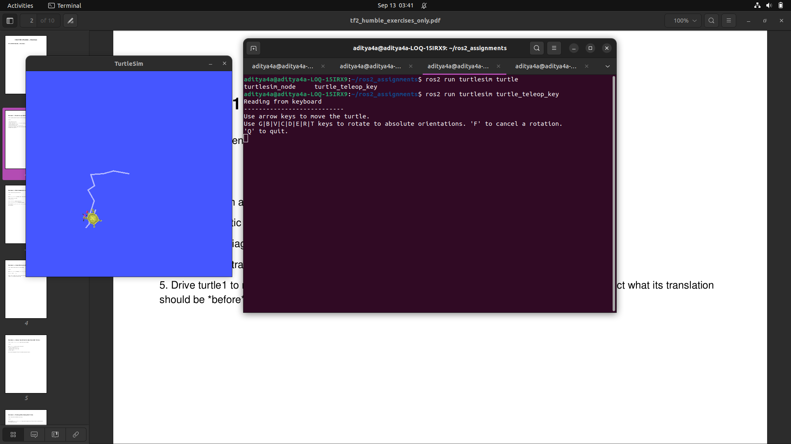
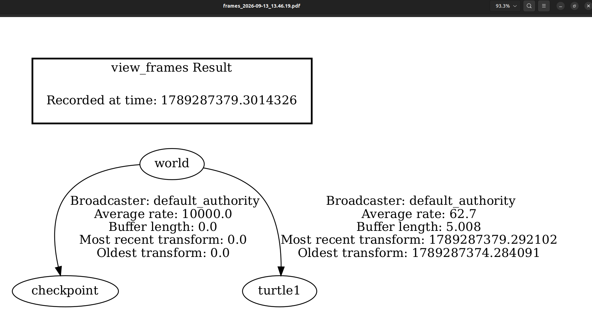
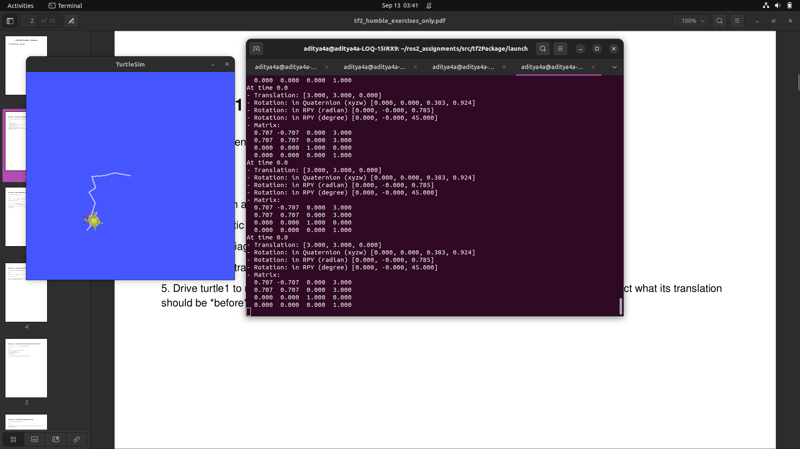
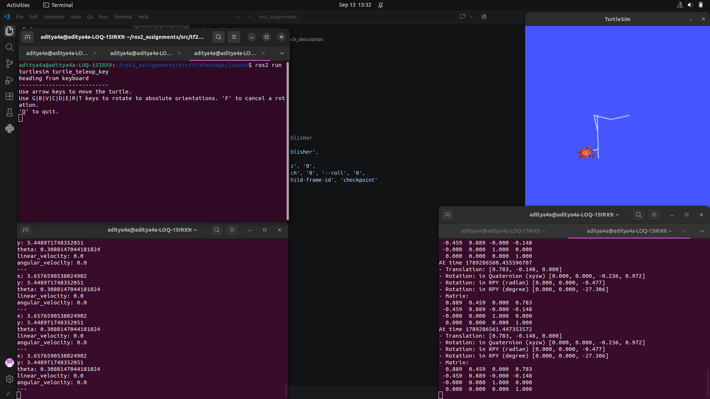

# Readme: Assignment 1 - Turtlesim & TF2

This guide walks through the steps to launch the turtlesim environment, create a static frame (`checkpoint`), and dynamically track transforms using `tf2`.

## Prerequisites
Make sure you have built your ROS 2 workspace and sourced it.
```bash
colcon build
source install/setup.bash
```

## Execution Steps

### 1. Launch the Environment
Navigate to your launch folder and run the launch file. This starts the turtlesim node and publishes the static `checkpoint` frame at (x: 3, y: 3, yaw: 45°).
```bash
ros2 launch tf2Package assign1_launch.py
```

### 2. Start the Teleop Node
Open a **new terminal**, source your workspace, and start the keyboard teleop node so you can drive the turtle using your arrow keys:
```bash
ros2 run turtlesim turtle_teleop_key
```



### 3. Monitor the Turtle's Pose (*helpful in verification)
To actively see the turtle's raw coordinate data streaming in the background, open another terminal and echo the pose topic:
```bash
ros2 topic echo /turtle1/pose
```


### 4. Broadcast the Turtle's Frame to TF2
By default, the turtle's position isn't part of the `tf2` transform tree. Run this broadcaster node in a **new terminal** to add `turtle1` to the world tree:
```bash
ros2 run turtle_tf2_py turtle_tf2_broadcaster --ros-args -p turtlename:=turtle1
```



### 5. Drive and Measure the Transform
Select your **teleop terminal** (from Step 2) and drive the turtle towards the checkpoint's physical coordinates on the screen. 

To verify the static checkpoint transform:


To see the live transform (distance and rotation) between the `checkpoint` (source) and `turtle1` (target), run this in a **new terminal**:
```bash
ros2 run tf2_ros tf2_echo checkpoint turtle1
```

*Note: When the turtle physically reaches the checkpoint on your screen, the translation values in this terminal will drop close to [0.0, 0.0, 0.0].*



