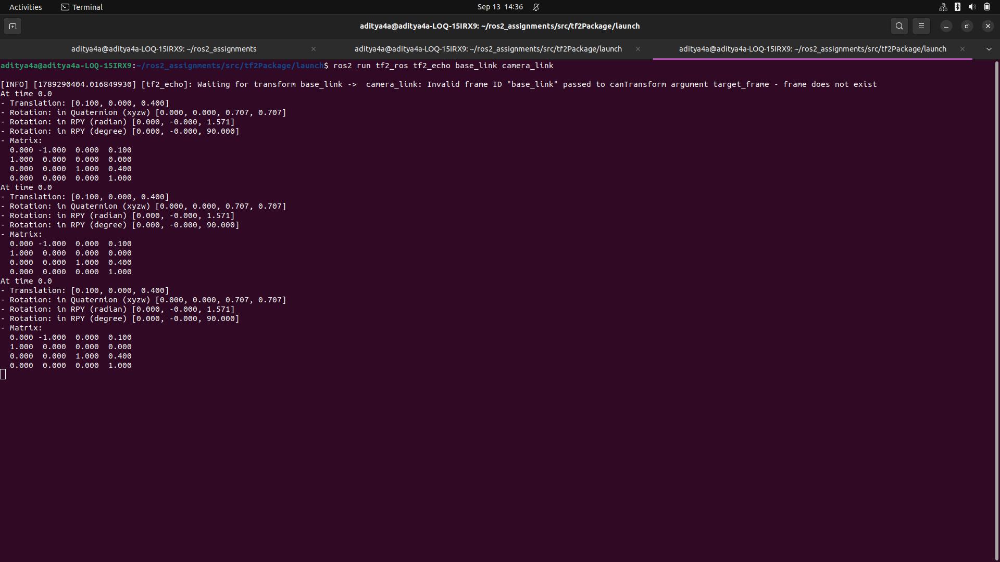
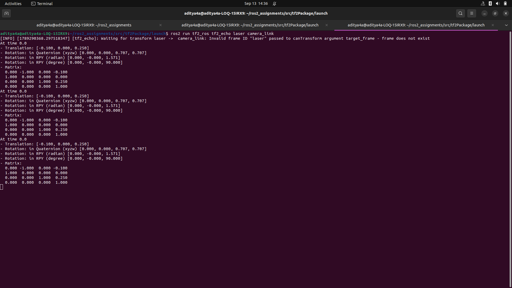
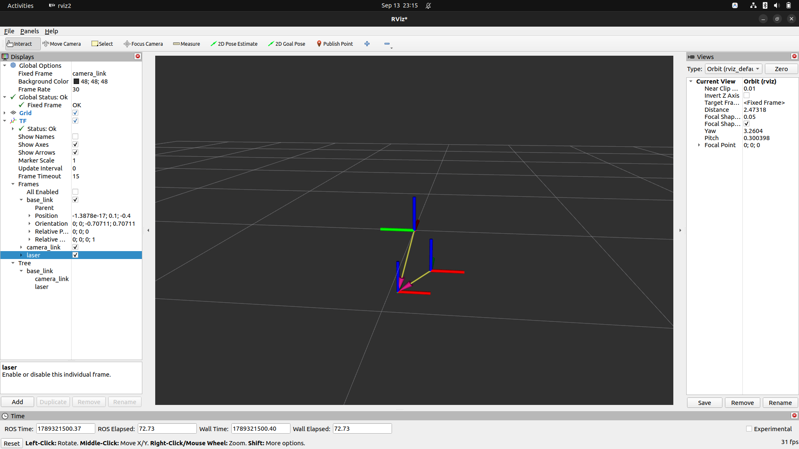
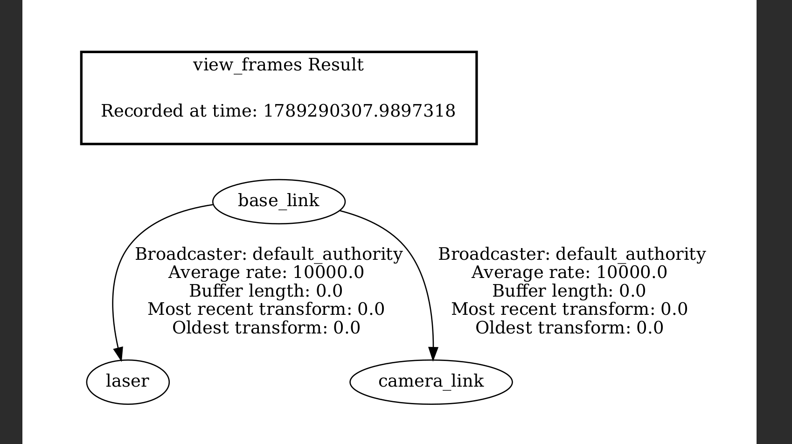

# STEPS

Run the launch file to start publishing the static transforms for laser and camera_link relative to base_link:

```bash
ros2 launch tf2Package sensor_mounts_launch.py
```

Open a new terminal, source your workspace, and run tf2_echo to test the transforms:

To check base_link to camera_link:
```bash
ros2 run tf2_ros tf2_echo base_link camera_link
```



To check laser to camera_link (prediction verification):

```bash
ros2 run tf2_ros tf2_echo laser camera_link
```

**OUT:-**

    At time 0.0
    - Translation: [-0.100, 0.000, 0.250]
    - Rotation: in Quaternion (xyzw) [0.000, 0.000, 0.707, 0.707]
    - Rotation: in RPY (radian) [0.000, -0.000, 1.571]
    - Rotation: in RPY (degree) [0.000, -0.000, 90.000]
    - Matrix:
    0.000 -1.000  0.000 -0.100
    1.000  0.000  0.000  0.000
    0.000  0.000  1.000  0.250
    0.000  0.000  0.000  1.000

---
## RVIZ OUTPUT



---
## Tree


