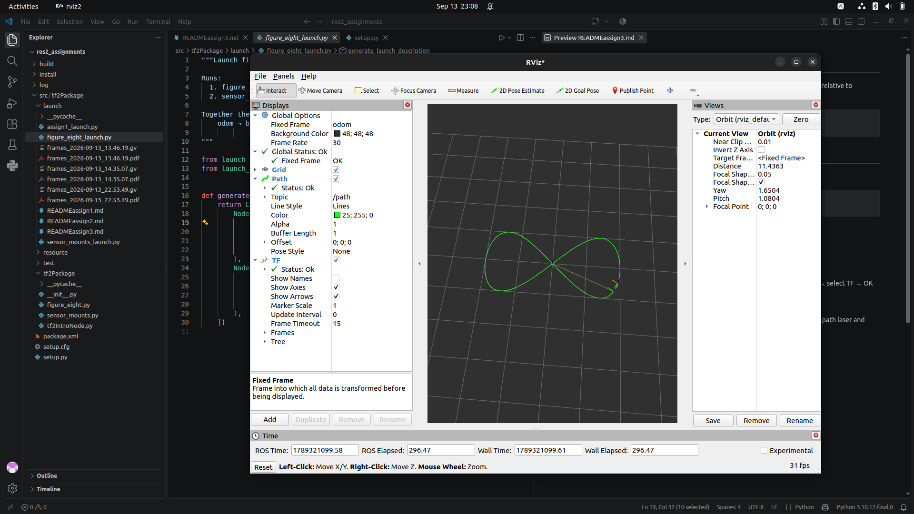
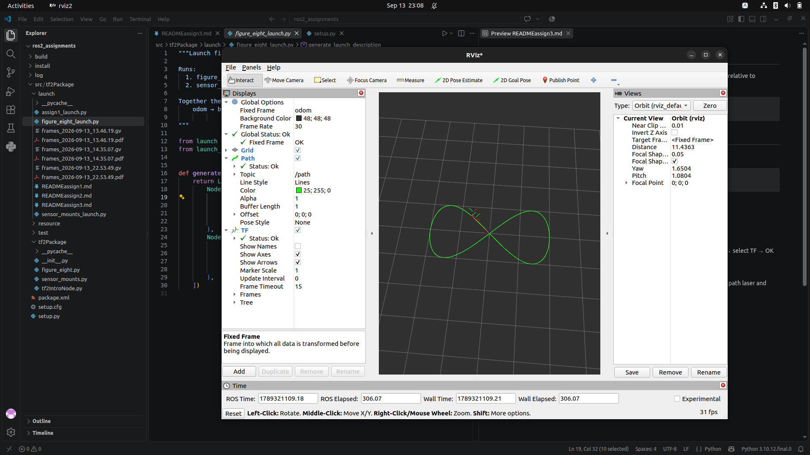

# STEPS

Run the launch file to start publishing the static transforms for laser and camera_link relative to base_link:

```bash
ros2 launch tf2Package figure_eight_launch.py
```

## RVIZ2
Laucnh RVIZ2
```bash
rivz2
```

In RViz2, do these 3 things:

a) Set Fixed Frame → odom (top-left, under Global Options)

b) Click Add → By topic → expand /path → select Path → OK

This draws the green line tracing the figure-eight trail
c) Click Add → By display type → select TF → OK

This shows the frame axes (base_link, laser, camera_link) moving
You should now see:

The green line drawing out a figure-eight shape
The TF frame axes moving along that path
laser and camera_link riding along with base_link

---
## Visualisation




- Video is also provided along with tree(.pdf) in this folder