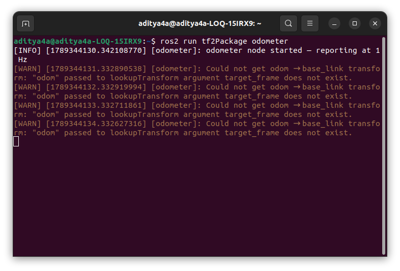
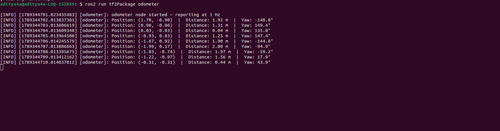

## How to test

Terminal 1 — Start the odometer first (before the broadcaster, to prove it survives):

```bash
source install/setup.bash
ros2 run tf2Package odometer
```

---
You should see warnings like:
- Reason :- figure of eight node wasn't run before odom node.
```bash
[WARN] Could not get odom → base_link transform: ...
Terminal 2 — Then start the figure-eight broadcaster:
```

---

```bash

source install/setup.bash
ros2 launch tf2Package figure_eight_launch.py
```
---

Back in Terminal 1, the warnings will stop and you'll see output like:
```bash
[INFO] Position: (1.73, 0.87)  |  Distance: 1.94 m  |  Yaw: 26.3°
```



