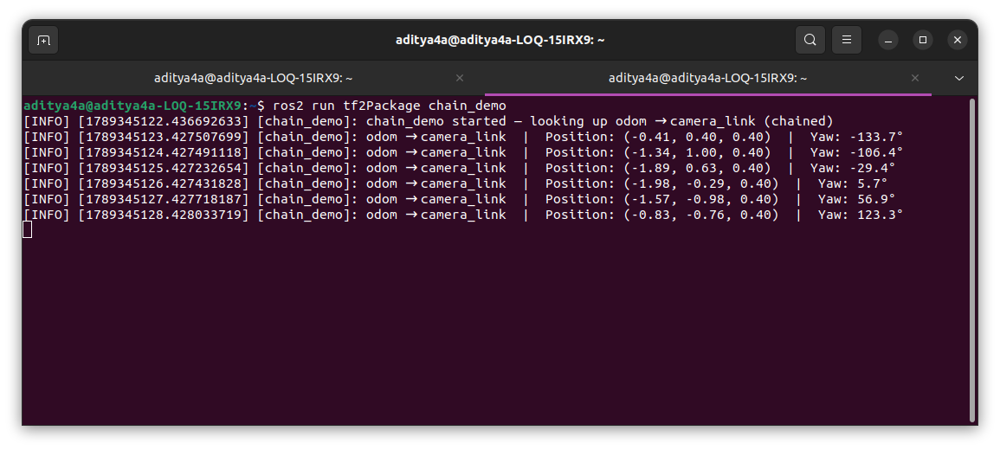

## How To Run

In Terminal 1, run the broadcaster from Exercise 3 (which also starts Exercise 2's static mounts):

```bash
source install/setup.bash
ros2 launch tf2Package figure_eight_launch.py
```
In Terminal 2, run the new chain_demo node:
```bash
source install/setup.bash
ros2 run tf2Package chain_demo
```

You should see output similar to this:
``` bash
 [INFO] odom → camera_link | Position: (0.10, 0.00, 0.40) | Yaw: 90.0° (Note: The position and yaw will change dynamically as base_link moves in the figure-eight!)
```


---
## The Explanation: The path tf2 took
The exercise asks to explain the path tf2 took since nobody is explicitly publishing the odom → camera_link transform.

Here is what happens behind the scenes:

tf2 maintains a "tree" (or graph) of all known frames in the system in the background.
Question path to camera link :- "How do I get from odom to camera_link?"
tf2 looks at its graph and finds the following path connecting them: odom → base_link (published dynamically at 50Hz by figure_eight.py) base_link → camera_link (published statically by sensor_mounts.py)
It mathematically multiplies the transforms along this path together (combining the translations and rotations) and returns the final composite transform directly to our code.(**Basically Calculating Forward Kinematics form the present 3 Links**)