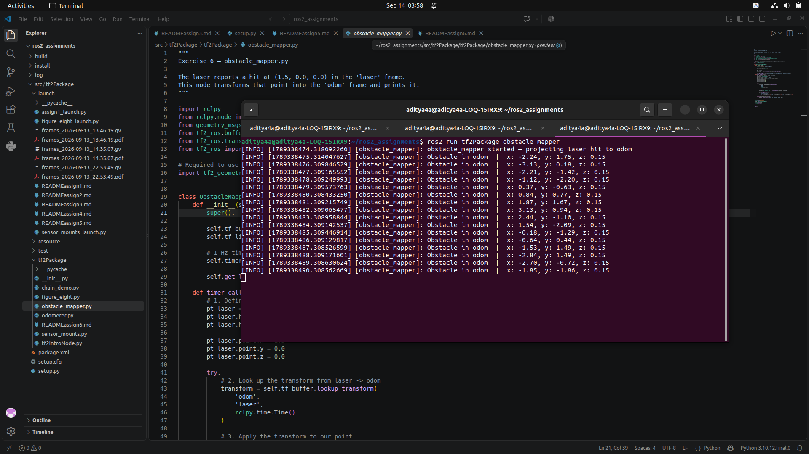

# How to test:

Start the figure eight: 
```bash
ros2 launch tf2Package figure_eight_launch.py
```

Start the obstacle mapper: 
```bash
ros2 run tf2Package obstacle_mapper
```
You will see it constantly projecting the (1.5, 0, 0) laser hit into the moving, rotating odom frame!


