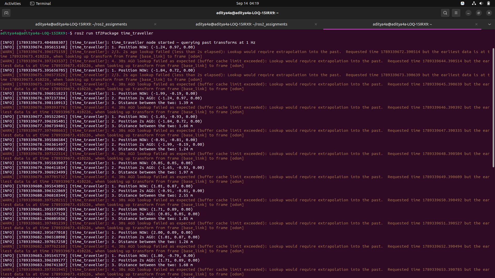

# Exercise 7 — Time Travel (Running Commands)

## How to test:

### Terminal 1: Start the Broadcaster (Robot moving in Figure-Eight)
```bash
source install/setup.bash
ros2 launch tf2Package figure_eight_launch.py
```

### Terminal 2: Run the Time Traveller Listener
```bash
source install/setup.bash
ros2 run tf2Package time_traveller
```

---

## What to observe:

1. **Position NOW:** Prints the robot's latest $(x, y, z)$ position in the `odom` frame.
2. **Position 2s AGO:** Retrieves the robot's position exactly 2 seconds prior by interpolating in the TF buffer.
3. **Distance:** Computes the straight-line distance between the robot's current position and its position 2 seconds ago.
4. **30s AGO Lookup (Cache Limit Hit):** 
   - Attempts to lookup the transform 30 seconds into the past.
   - By default, the TF2 buffer cache holds **10 seconds** of transform history.
   - It cleanly catches and reports `tf2.ExtrapolationException` explaining that 30 seconds is past the buffer's cache window without crashing.


