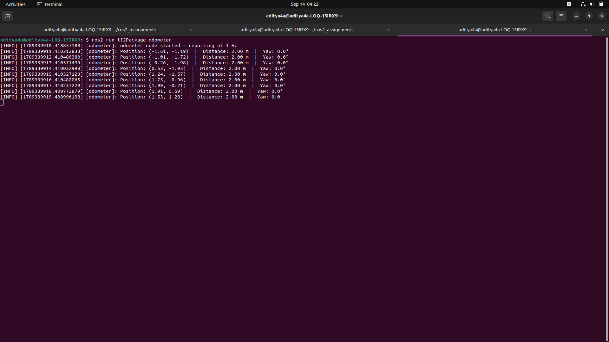

You can run it against your odometer from Exercise 4 to see it working:

Terminal 1:

```bash
source install/setup.bash
ros2 run tf2Package fixed_broadcaster
```
Terminal 2:

```bash
source install/setup.bash
ros2 run tf2Package odometer
```


