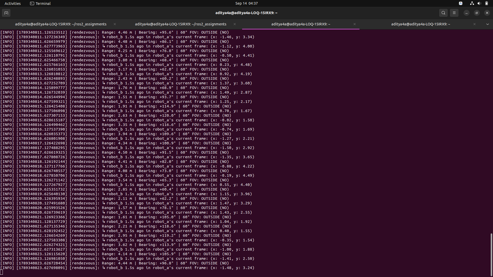

# Exercise 9 — Mini-project: Two-Robot Rendezvous

## Overview
This mini-project combines dynamic TF broadcasting, static sensors, frame transformations, and advanced time-travel querying (`lookup_transform_full`).

### Frames Published
- `world` → `robot_a`: Circle $R=3.0\text{ m}$, $\omega=0.3\text{ rad/s}$ (counter-clockwise)
- `world` → `robot_b`: Circle $R=1.5\text{ m}$, $\omega=0.7\text{ rad/s}$ (clockwise / opposite direction)
- `robot_a` → `robot_a/front_sensor`: Static sensor mounted $0.25\text{ m}$ forward ($+x$)
- `robot_b` → `robot_b/front_sensor`: Static sensor mounted $0.25\text{ m}$ forward ($+x$)

---

## Running Commands

### Option A: Launch Everything Together
```bash
source install/setup.bash
ros2 launch tf2Package rendezvous_launch.py
```

### Option B: Run in Separate Terminals

**Terminal 1 — Broadcaster:**
```bash
source install/setup.bash
ros2 run tf2Package two_robots_broadcaster
```

**Terminal 2 — Rendezvous Listener (2 Hz):**
```bash
source install/setup.bash
ros2 run tf2Package rendezvous
```

**Terminal 3 (Optional) — View in RViz2:**
```bash
rviz2
```
In RViz2:
- Set **Fixed Frame** to `world`
- Add **TF** display to observe both robots orbiting and their front sensors riding along.

---

## What the Rendezvous Node Reports (at 2 Hz)
1. **Range & Bearing:**
   - Range in meters between `robot_a` and `robot_b`
   - Bearing in degrees relative to `robot_a`'s forward heading
2. **60° Forward Field of View (FOV):**
   - Evaluates whether $|\text{bearing}| \le 30^\circ$ (forward $60^\circ$ cone).
3. **Advanced Time Travel:**
   - Evaluates where `robot_b` was $1.5\text{ s}$ ago, expressed in `robot_a`'s **current** coordinate frame using `lookup_transform_full`.


--- 
## For RVIZ2 simulation refer .webm file in this folder
---
